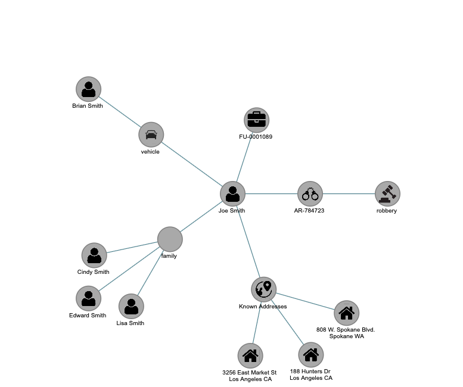

# LinkAnalysis



A graph-visualization library for intelligence / criminal link-analysis networks,
built around the **POLE** entity model.

> **POLE** stands for **P**eople, **O**bjects, **L**ocations, **E**vents — the four
> core entity types used in intelligence and criminal-investigation link analysis.
> A person of interest (a *Person*) is connected to the vehicles they use (*Objects*),
> the addresses they frequent (*Locations*) and the incidents they are involved in
> (*Events*), and LinkAnalysis renders those relationships as a graph.

## Status

The core is being modernized into ES modules bundled with [Bun](https://bun.sh).
The data model (`Graph`, `Node`, `Link`) and the geometry helpers (`trigo`) are
now ES modules with a test suite.

**Layout algorithms live in the [GraphJS](https://github.com/MarcMouries/GraphJS)
engine, not here.** LinkAnalysis depends on `graphjs` (published on npm) and
re-exports its `ForceDirected`, `RadialLayout` and `TreeLayout`, so you can import
them from either package:

```javascript
import { RadialLayout } from "link-analysis"; // re-exported from the engine
import { RadialLayout } from "graphjs";        // or straight from the engine
```

LinkAnalysis owns the domain layer: the data model, the POLE data adapter
(`transformServiceNowData` / `validatePOLEData`), and (upcoming) POLE node/edge
templates and presets. The legacy canvas renderer and `PieMenu` are still
`<script>`-loaded by the interactive demos under [`examples/`](examples/) and will be
rewired onto the GraphJS engine.

## Layout

`test/` holds the automated `bun test` suite; `examples/` holds the interactive
browser demos (see [`examples/README.md`](examples/README.md)).

## Development

```bash
bun install        # install dev tooling (nothing external is required to build)
bun run build      # produce dist/esm, dist/cjs and dist/umd bundles
bun test           # run the test suite
bun run dev        # rebuild the ESM bundle on change (watch mode)
```

### Build outputs

| Field     | File                            | Format |
|-----------|---------------------------------|--------|
| `module`  | `dist/esm/index.js`             | ESM (`import`) |
| `main`    | `dist/cjs/index.cjs`            | CommonJS (`require`) |
| `browser` | `dist/umd/link-analysis.min.js` | IIFE — exposes `window.LinkAnalysis` |

Build artifacts under `dist/` are generated on demand (and on `prepublishOnly`);
they are not committed.

## Usage

```javascript
import { transformServiceNowData } from "link-analysis";
import { Graph, RadialLayout } from "graphjs";

// Domain layer: validate + normalise ServiceNow / POLE data.
const graphData = transformServiceNowData({
  nodes: [
    { id: "1", type: "person", is_subject: true, first_name: "Eric", last_name: "Fox" },
    { id: "2", type: "location", name: "3260 Jay St, Santa Clara, CA" },
  ],
  edges: [{ source: "1", target: "2", label: "Known Address", type: "address" }],
});

// Engine: load it and lay it out.
const graph = new Graph();
graph.loadJSON(graphData);
new RadialLayout(graph, { centerNode: "1", center: { x: 400, y: 300 } }).run();
// each node now has x / y coordinates
```
